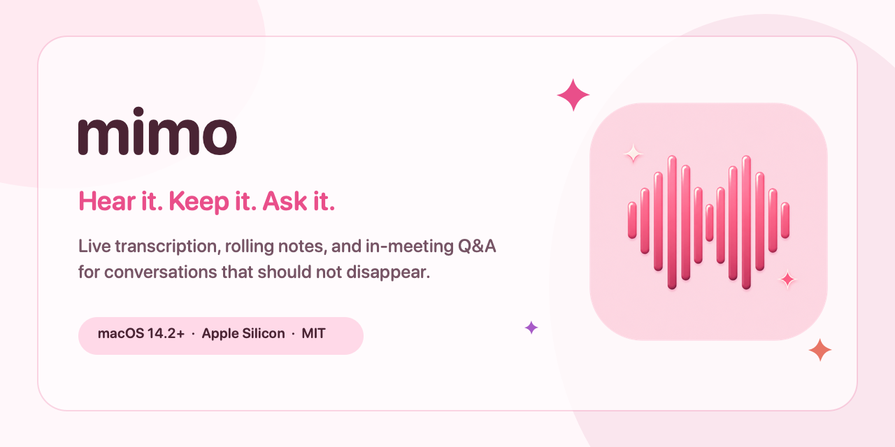
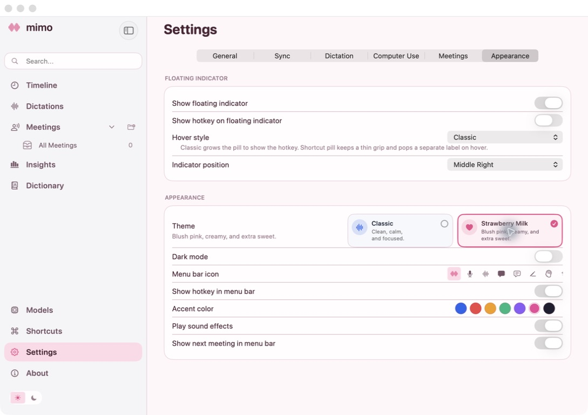

<p align="center">
  
</p>

<p align="center">
  <a href="https://github.com/ederntjw/mimo/releases"><strong>Download Mimo for macOS</strong></a>
  &nbsp;·&nbsp;
  <a href="#live-meetings-that-stay-live">Live meetings</a>
  &nbsp;·&nbsp;
  <a href="#build-and-test">Build from source</a>
</p>

Mimo is a native Mac companion for conversations that keep moving. It transcribes
in-person and online meetings as they happen, maintains a rolling brief, and lets
you ask questions about what has already been said without stopping the recording.

It also handles everyday dictation, voice-directed text editing, and transcription
of existing audio or video files. Speech recognition can stay on your Mac; the
reasoning provider for summaries, questions, and cleanup is your choice.

> **Preview status:** Mimo is under active development for Apple Silicon Macs.
> The macOS app is the current focus, with the iPhone companion following the
> desktop workflow.

## The short version

| You want to… | Mimo can… |
|---|---|
| Follow an in-person discussion | Listen through the Mac microphone and build a live transcript |
| Capture Zoom, Meet, Teams, or another call | Record microphone and system audio as separate sides of the conversation |
| Catch up without interrupting | Maintain a rolling brief of decisions, actions, key points, and open questions |
| Ask while people are still talking | Answer from a read-only snapshot of committed transcript while recording continues |
| Reuse an old recording | Import `.mp3`, `.mp4`, `.m4a`, or `.wav` and turn it into a transcript and notes |
| Rewrite text by voice | Highlight text, speak the change with Quill, and replace the selection in place |
| Type anywhere by speaking | Use the global dictation hotkey and paste the result at the cursor |

## Live meetings that stay live

Mimo is designed around one important constraint: asking a question or refreshing
notes must never pause capture.

1. Open **Meetings** and choose **Start Live Meeting**.
2. Mimo records the room through your microphone. For an online call, it can also
   capture the other side through macOS system audio.
3. Committed speech appears in the transcript while partial speech continues to
   update at the edge of the conversation.
4. The live brief refreshes as enough new context arrives.
5. Ask a question such as “What deadline did we agree on?” Mimo answers from the
   transcript collected up to that moment while recording keeps running.
6. Stop when the conversation ends. The transcript, notes, and meeting history stay
   together for later search and export.

No meeting bot has to join the room. In-person meetings need only microphone access;
online capture additionally uses macOS System Audio Recording permission.

## A Mac app with two personalities

Classic remains the calm default. Strawberry Milk is an opt-in blush interface with
rounded typography, pink surfaces, heart and sparkle details, and a matching Dock
icon. Switching themes is immediate and does not require a restart.

<p align="center">
  
</p>

Choose it from **Settings → Appearance → Theme**. Strawberry Milk initially selects
the Pink accent; the accent remains independently customizable afterward.

## More than meeting notes

### Quill

Select text in another app, hold the Quill shortcut, and describe the edit you want.
Mimo captures the selection before recording, sends the original text and spoken
instruction to the configured cleanup model, then replaces the selection. With no
selection, Quill can create text at the cursor instead.

### Recorded files

Use **Import Audio** for lectures, interviews, voice memos, podcasts, or screen
recordings you already have. Imported media follows the same transcription,
diarization, note-generation, search, and export pipeline as a live meeting.

### Dictation

Hold the dictation hotkey, speak, and release. Mimo transcribes and pastes into the
active app. Hands-free double-tap mode, a personal dictionary, filler-word removal,
and optional cleanup are available when you need them.

### Meeting memory

Meetings can be organized in folders, searched, re-summarized with another template,
and exported as Markdown or PDF. The local database keeps the core workflow
available even when the Mac is offline.

## Models and privacy

Transcription and reasoning are separate choices in Mimo.

| Job | Recommended starting point | Other options |
|---|---|---|
| Live and batch transcription | Parakeet Unified on-device | Parakeet Realtime EOU, Nemotron, Whisper, Apple Speech, Qwen3 ASR, SenseVoice, and hosted transcription |
| Meeting summaries and live Q&A | ChatGPT subscription sign-in | OpenAI or OpenRouter with an API key, Ollama, LM Studio, or a compatible custom endpoint |
| Quill and dictation cleanup | The configured cleanup model | ChatGPT, hosted providers, or supported local models |

With an on-device transcription model, microphone audio is processed locally.
If you select a hosted transcription provider, audio is sent to that provider. If
you select ChatGPT or another hosted reasoning provider for summaries, questions,
or cleanup, the relevant transcript or text is sent only for that requested task.
Credentials are stored in Mimo's app-support directory with owner-only permissions.

## Install

### Download the DMG

1. Open the [Mimo releases page](https://github.com/ederntjw/mimo/releases).
2. Download the newest `Mimo-*.dmg` asset.
3. Open the disk image and drag **Mimo** into **Applications**.
4. Launch Mimo and follow onboarding for the permissions and transcription model.

Current preview builds may not yet be notarized for public distribution. If macOS
blocks the first launch, Control-click Mimo in Applications and choose **Open**.
Never bypass a warning for a copy downloaded from somewhere other than this
repository's release page.

### Updates

Mimo checks for signed updates automatically once per day. You can also choose
**Check for Updates…** from its menu-bar menu at any time. When a release is
available, Mimo shows the release notes, downloads the DMG through Sparkle, verifies
it with Mimo's dedicated EdDSA public key, installs it, and relaunches. An existing
installation therefore does not need another manual drag to Applications.

Maintainers publish an update from a clean, CI-passing `main` branch with one tag:

```bash
./scripts/publish_mimo_update.sh 0.8.6
```

The tag-triggered GitHub workflow builds the native Mac app, signs the update
metadata using the protected `MIMO_SPARKLE_PRIVATE_KEY` repository secret, verifies
the exact DMG, creates the GitHub Release, and moves the stable appcast feed to it.
The private signing key is never committed to this repository.

### Requirements

- Apple Silicon Mac
- macOS 14.2 or later
- Xcode 16 or later only when building from source
- Microphone permission for speech capture
- Accessibility and Input Monitoring for global hotkeys and text insertion
- System Audio Recording for online-meeting capture

The recommended Parakeet model downloads on first setup, so allow roughly 450 MB
for its model files in addition to the application.

## Build and test

```bash
git clone https://github.com/ederntjw/mimo.git
cd mimo

# Build, test, and install an isolated development lane.
./scripts/dev-test.sh --lane A

# Run the complete Swift package test suite directly.
swift test --package-path native/MuesliNative \
  --scratch-path "$HOME/Library/Caches/muesli-spm/test"
```

Signed app bundles require the complete LocalVQE runtime used for acoustic echo
cancellation:

```bash
source scripts/localvqe_runtime.sh
if ! muesli_localvqe_runtime_is_complete native/MuesliNative/LocalVQE/lib; then
  ./scripts/build_localvqe.sh
fi
```

Contributor builds use fixed dev lanes (`A`, `B`, or `C`) so they do not overwrite
the production app or share its support directory. See [AGENTS.md](AGENTS.md) for
the exact packaging/cache rules and [CONTRIBUTING.md](CONTRIBUTING.md) for the full
development workflow.

Some source paths and internal executable identifiers still retain the historical
`Muesli` name while the migration proceeds. The installed product, release assets,
and user-facing interface are Mimo.

## Project map

```text
native/MuesliNative/   macOS application, shared services, and Swift tests
native/MuesliXcode/    generated Xcode application target
muesli-ios/            iPhone companion project
scripts/               development, verification, packaging, and release tools
docs/                  product, privacy, release, and engineering documentation
assets/                Mimo artwork and supporting application assets
```

Before opening a large pull request, please start with an issue describing the
problem and intended behavior. Every change should include proportionate tests and
preserve the local-first path.

## Foundation and acknowledgements

Mimo began with the MIT-licensed native macOS foundation from
[Muesli](https://github.com/Muesli-HQ/muesli). The original copyright notice is
preserved in [LICENSE](LICENSE); this README, Mimo product direction, live meeting
assistant, Strawberry Milk identity, and subsequent application work are maintained
as the Mimo project.

The application also relies on excellent open-source work including
[FluidAudio](https://github.com/FluidInference/FluidAudio),
[WhisperKit](https://github.com/argmaxinc/WhisperKit),
[LocalVQE](https://github.com/localai-org/LocalVQE), and Apple's native audio,
Core ML, and SwiftUI frameworks.

## License

Mimo is available under the [MIT License](LICENSE).
