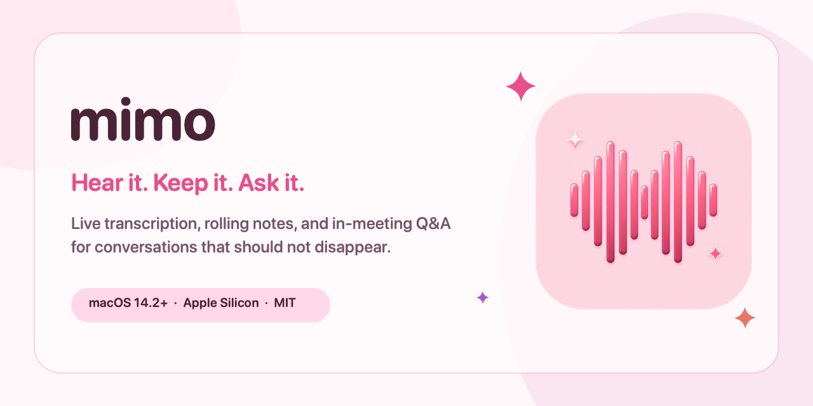
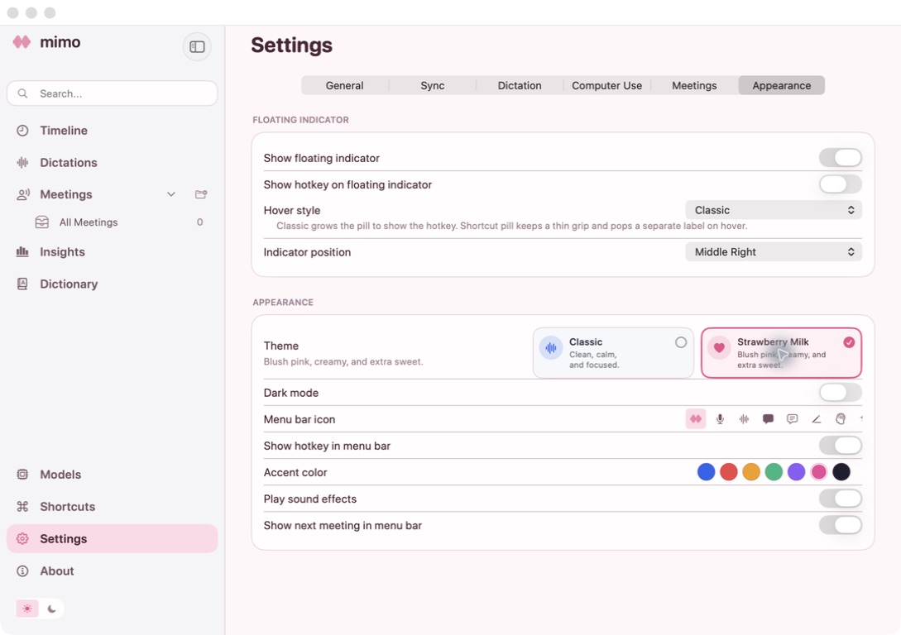

<p align="center">
  
</p>

<p align="center">
  <a href="https://github.com/ederntjw/mimo/releases"><strong>Download Mimo for macOS</strong></a>
  &nbsp;·&nbsp;
  <a href="#live-meetings-that-stay-live">Live meetings</a>
  &nbsp;·&nbsp;
  <a href="#build-and-test">Build from source</a>
</p>

Mimo is a native Mac companion for conversations that keep moving. It transcribes
in-person and online meetings as they happen, maintains a rolling brief, and lets
you ask questions about what has already been said without stopping the recording.

It also handles everyday dictation, voice-directed text editing, and transcription
of existing audio or video files. New installations use one Chinese–English setup:
full Whisper Large v3 transcribes on your Mac, and your connected ChatGPT account
handles cleanup, notes, and questions. There are no model selectors to manage.
Existing installations retain their previous provider settings until they opt in.

Mimo runs on Apple silicon Macs. The macOS app is the current focus; companion
apps follow the desktop workflow.

## The short version

| You want to… | Mimo can… |
|---|---|
| Follow an in-person discussion | Listen through the Mac microphone and build a live transcript |
| Capture Zoom, Meet, Teams, or another call | Record microphone and system audio as separate sides of the conversation |
| Catch up without interrupting | Maintain a rolling brief of decisions, actions, key points, and open questions |
| Ask while people are still talking | Answer from a read-only snapshot of committed transcript while recording continues |
| Reuse an old recording | Import `.mp3`, `.mp4`, `.m4a`, or `.wav` and turn it into a transcript and notes |
| Rewrite text by voice | Highlight text, speak the change with Quill, and replace the selection in place |
| Type anywhere by speaking | Use the global dictation hotkey and paste the result at the cursor |

## Live meetings that stay live

Mimo is designed around one important constraint: asking a question or refreshing
notes must never pause capture.

1. Prepare the speech model in **Speech & notes**, connect your ChatGPT account,
   then choose **Start a meeting**.
2. Mimo records the room through your microphone. For an online call, it can also
   capture the other side through macOS system audio.
3. Full Whisper Large v3 supplies Mandarin–English text in batches with automatic
   language detection. Capture continues while each batch is processed.
4. The live brief refreshes as enough new context arrives.
5. Ask a question such as “What deadline did we agree on?” Mimo answers from the
   transcript collected up to that moment while recording keeps running.
6. Stop when the conversation ends. The same Whisper model transcribes the
   complete recording, then Mimo compares it with the live draft before generating
   English minutes. A transcript-review section flags differences to confirm.

The simple setup uses full Whisper Large v3 for dictation, live meeting batches,
and the final pass. Prepare this one model before recording. Mimo does not silently
substitute a smaller model. Your recording-save preference controls whether audio
is retained after processing. See the [model guide](docs/model-guide.md) for requirements.

No meeting bot has to join the room. In-person meetings need only microphone access;
online capture additionally uses macOS System Audio Recording permission.

## A Mac app with ten moods

Classic remains the calm default. Strawberry Milk, Cherry Ribbon, Lavender Dream,
Peach Sorbet, Mint Macaron, and Rose Quartz bring softer palettes and rounded details;
Neon Grid, Aurora Glass, and Solar Flare add bolder futuristic color systems.
Switching themes is immediate and does not require a restart.

<p align="center">
  
</p>

Choose a palette from **Settings → Appearance → Theme**. Each styled theme initially
selects its matching accent; the accent remains independently customizable afterward.

## More than meeting notes

### Quill

Select text in another app, hold the Quill shortcut, and describe the edit you want.
Mimo captures the selection before recording, sends the original text and spoken
instruction to the configured cleanup model, then replaces the selection. With no
selection, Quill can create text at the cursor instead.

### Recorded files

Use **Import Audio** for lectures, interviews, voice memos, podcasts, or screen
recordings you already have. Imported media follows the same transcription,
diarization, note-generation, search, and export pipeline as a live meeting.

### Dictation

Hold the dictation hotkey, speak, and release. Mimo transcribes and pastes into the
active app. Hands-free double-tap mode, a personal dictionary, and spoken snippets
are available. Cleanup has None, Light, and Medium strengths; new dictations keep
their original text locally so you can recover wording before cleanup. Speak a
snippet phrase on its own to insert its saved text exactly as written.

### Meeting memory

Meetings can be organized in folders, searched, re-summarized with another template,
and exported as Markdown or PDF. The local database keeps the core workflow
available even when the Mac is offline.

## Models and privacy

The simple setup separates local speech recognition from connected writing.

| Job | Simple Chinese–English setup |
|---|---|
| Dictation, live meeting batches, final transcription | Full Whisper Large v3 on this Mac |
| Meeting summaries, live Q&A, and Quill | Connected ChatGPT subscription |
| Dictation cleanup | ChatGPT, with Light cleanup by default; None skips the cleanup request |

Audio is transcribed locally. Cleanup, notes, questions, and rewrites need internet
access and send the relevant text to ChatGPT. Optional nearby app/screen context is
also sent when enabled. Connected Mimo Account sync uploads transcripts and notes;
its controls remain available in **Settings → Privacy**.
Existing users keep their previous model/provider setup and can opt in from
**Models**. That switch explains the local speech and ChatGPT text processing first.
Account sessions and provider credentials remain local, in macOS Keychain or
permission-restricted local files, and are never part of Mimo Account sync.

## Install

### Download the DMG

1. Open the [Mimo releases page](https://github.com/ederntjw/mimo/releases).
2. Download the newest `Mimo-*.dmg` asset.
3. Open the disk image and drag **Mimo** into **Applications**.
4. Launch Mimo and follow onboarding for the permissions and transcription model.

The public release workflow requires Developer ID signing and Apple notarization
before publication. A normal first-open confirmation may appear. If macOS says a
copy is damaged or cannot be verified, download a fresh copy from this repository's
release page and report the issue if it persists.

### Updates

Mimo checks for signed updates automatically once per day. You can also choose
**Check for Updates…** from its menu-bar menu at any time. When a release is
available, Mimo shows the release notes, downloads the DMG through Sparkle, verifies
it with Mimo's dedicated EdDSA public key, installs it, and relaunches. An existing
installation therefore does not need another manual drag to Applications.

Maintainers publish an update from a clean, CI-passing `main` branch with one tag:

```bash
./scripts/publish_mimo_update.sh 0.9.0
```

The tag-triggered GitHub workflow builds and signs the native Mac app with
Developer ID, notarizes and staples the app and DMG, then signs the final update
metadata using the protected `MIMO_SPARKLE_PRIVATE_KEY` repository secret. It
creates a draft release, downloads and verifies the uploaded files, and only then
publishes the release and moves the stable appcast feed to it. Signing and
notarization credentials are required. Mimo Account sync is optional: leave both
Supabase client settings absent for a library stored on this Mac, or configure
both to enable account sync. An incomplete pair or invalid project URL stops the
release. Private keys are never committed to this repository.

### Requirements

- Apple Silicon Mac
- macOS 14.2 or later
- Xcode 16 or later only when building from source
- Microphone permission for speech capture
- Accessibility and Input Monitoring for global hotkeys and text insertion
- System Audio Recording for online-meeting capture

Full Whisper Large v3 downloads separately (about 3.1 GB). For the simple setup,
Mimo recommends at least 16 GB total Mac RAM, preferably 24 GB, and 9 GB free disk
for initial preparation. These are planning estimates; performance depends on
your Mac and other running apps. ChatGPT writing needs a connected account with
available usage. No local writing model is needed for this setup. The bundle still
includes Mimo Tiny Cleanup for compatibility with existing local-only configurations.
The [model guide](docs/model-guide.md) distinguishes download sizes, working memory,
and total Mac RAM recommendations.

## Build and test

```bash
git clone https://github.com/ederntjw/mimo.git
cd mimo

# Build, test, and install an isolated development lane.
./scripts/dev-test.sh --lane A

# Run the complete Swift package test suite directly.
swift test --package-path native/MuesliNative \
  --scratch-path "$HOME/Library/Caches/muesli-spm/test"
```

Signed app bundles require the complete LocalVQE runtime used for acoustic echo
cancellation:

```bash
source scripts/localvqe_runtime.sh
if ! muesli_localvqe_runtime_is_complete native/MuesliNative/LocalVQE/lib; then
  ./scripts/build_localvqe.sh
fi
```

Contributor builds use fixed dev lanes (`A`, `B`, or `C`) so they do not overwrite
the production app or share its support directory. See [AGENTS.md](AGENTS.md) for
the exact packaging/cache rules and [CONTRIBUTING.md](CONTRIBUTING.md) for the full
development workflow.

## Project map

```text
native/MuesliNative/   macOS application, shared services, and Swift tests
native/MuesliXcode/    generated Xcode application target
muesli-ios/            iPhone companion project
scripts/               development, verification, packaging, and release tools
docs/                  product, privacy, release, and engineering documentation
assets/                Mimo artwork and supporting application assets
```

Before opening a large pull request, please start with an issue describing the
problem and intended behavior. Every change should include proportionate tests and
preserve the local-first path.

## Open-source components

The application also relies on excellent open-source work including
[FluidAudio](https://github.com/FluidInference/FluidAudio),
[WhisperKit](https://github.com/argmaxinc/WhisperKit),
[LocalVQE](https://github.com/localai-org/LocalVQE), and Apple's native audio,
Core ML, and SwiftUI frameworks.

## License

Mimo is available under the [MIT License](LICENSE).
Required copyright and third-party notices are preserved in [LICENSE](LICENSE)
and [NOTICE](NOTICE).

Maintainers: see [Mimo release signing and notarization](docs/mimo-release-setup.md)
for the GitHub download setup and release checks.
